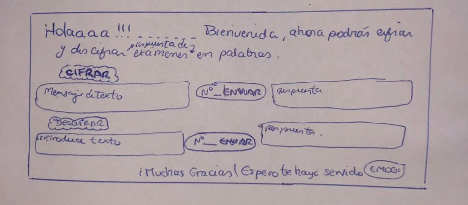
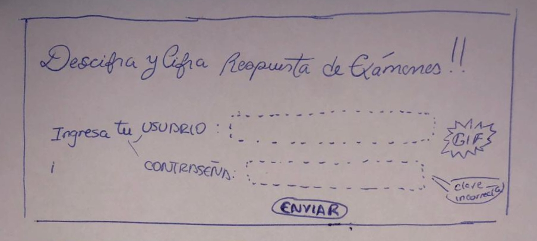
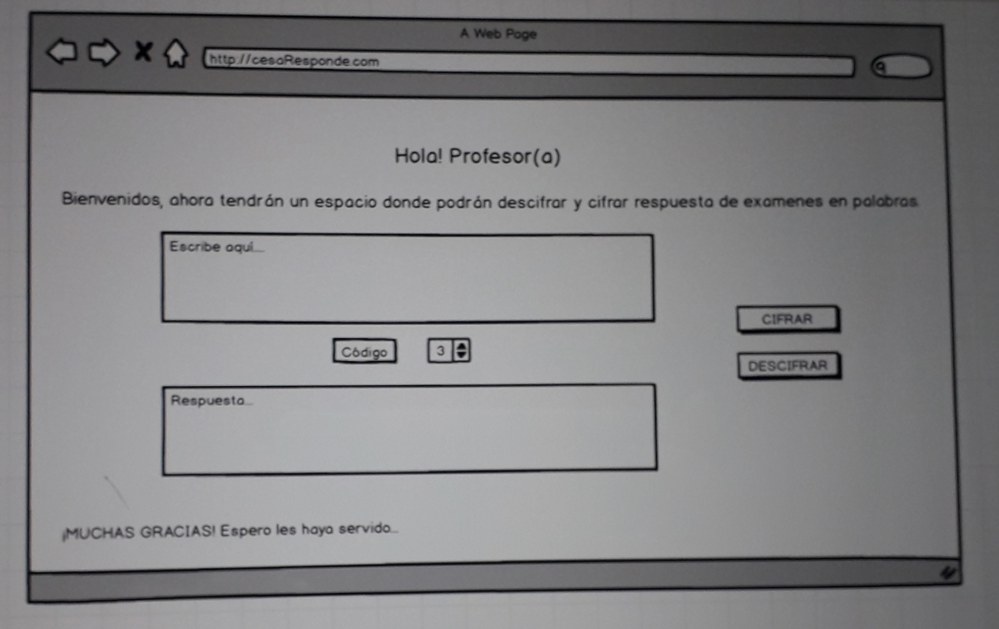
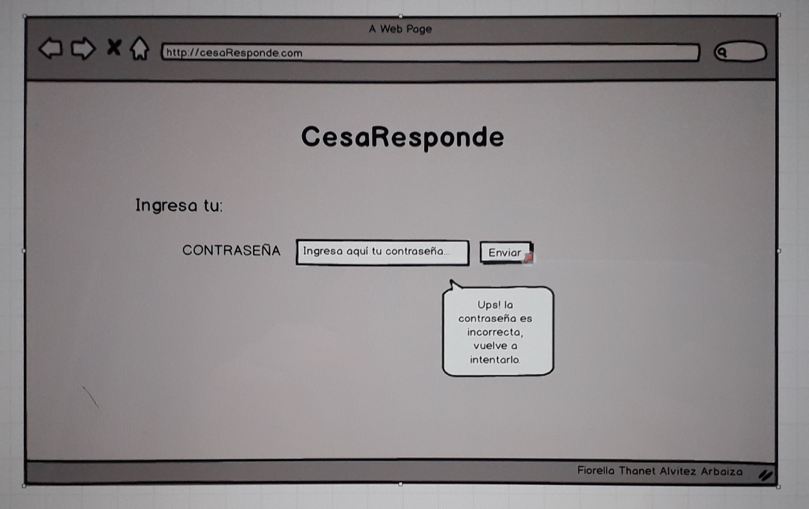

# CesaResponde

## Índice

- [Índice](#índice)
- [Resumen del Proyecto](#resumen-del-Proyecto)
- [Investigación de UX](#investigación-de-UX)
  - [Usuario y Objetivos](#planificación-agile-scrum)
  - [Cómo el producto soluciona los problemas/necesidades de los usuarios](#como-el-producto-soluciona-los-problemas/-necesidades-de-los-usuarios)
- [Prototipo de Papel y Lapiz](#prototipo-de-papel-y-lapiz)
- [Resumen de feedback del Proyecto](#resumen-de-feedback-del-proyecto)
- [Prototipo en Balsamiq](#prototipo-en-balsamiq)

## Resumen del Proyecto

La plataforma **CesaResponde** busca facilitar el acceso exclusivo de profesores con la finalidad de obtener las respuestas de exámenes formulada por ellos mismos,de esta manera los mismos docentes podrán crearlas a través de códigos y compartirlas con sus colegas con un cifrado y descifrado.

## Investigación de UX

### **Usuarios y Objetivos**

Esta plataforma va dirigida para profesores que decidan mandarse respuestas del examen ya convertidas en códigos secretos, para que solo sea comprendido por sus colegas. El objetivo a realizar es que puedan contar con la confianza de que sus respuestas estarán seguras para un buen examen. 

### **Cómo el producto soluciona los problemas/necesidades de los usuarios**

El producto final tiene como solución brindarle a cada usuario (docentes) que ingresando y conectando un código (offset) de un número que ellos elijan obtengan una respuesta para ser compartida con los demás maestros y sientan que no sólo consigan un resultado sino que al traer una mayor seguridad en los exámenes, les genere una experiencia confiable para ser compartida con el resto de colegas.

## **Propotipo de papel y lapiz**

 

### **Resumen de feedback del Proyecto**

Dentro de lo que estaba deficiente la plataforma, se encontró lo siguiente:

*-La letra no era muy legible.*

*-Contaba con demasiados cuadros para escribir el texto.*

*-Ingresar con usuario y contraseña lo hacían menos rápido.*

Entonces se afianzó lo siguiente:

*-Se colocó un tipo y tamaño de letra considerable.* 

*-Se atino a colocarle solo dos cuadros uno de mensaje y otro de respuesta.*

*-Colocarle solo contraseña gneró el fácil acceso.*

Gracias a estas medidas se pudo obtener una experiencia entendible para el usuario. 

## **Prototipo en Balsamiq**

 
  
